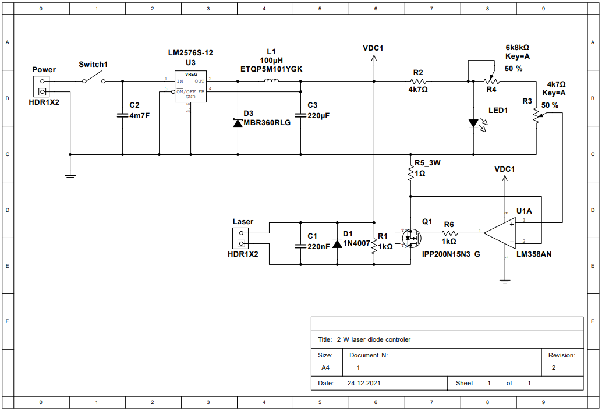
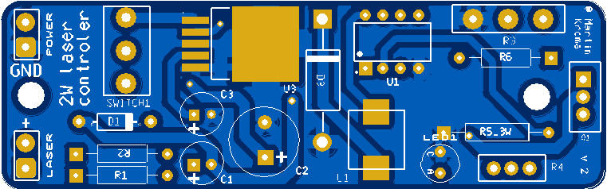
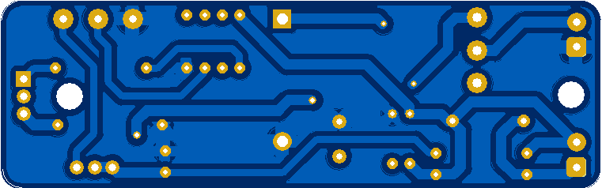

# 2 W Laser controler
Controller for 2 W laser diode M140. The PCB offers basic control options (on / off and setting the current flowing into the laser diode). Trimmer R4 is used to set the maximum output current and R3 to regulate the current flowing into the diode. Transistor Q1 and laser diode must be heatsinked !!
> PCB Input Voltage: 4 - 40 VDC

## Connection diagram:

  

## Parts:
| RefDes  | Description   | Family            | Package                   |
|---------|---------------|-------------------|---------------------------|
| D1      | 1N4007        | DIODE             | DO-35                     |
| R4      | 6k8kΩ         | POTENTIOMETER     | 33292W-1-502LF            |
| LED1    | LED_blue      | LED               | LED9R2_5Vb                |
| Q1      | IPP200N15N3 G | POWER_MOS_N       | TO-220-3(PG-TO-220-3)     |
| R3      | 4k7Ω          | RESISTOR          | 16PMI-4K7 SR PASSIVES     |
| R2      | 4k7Ω          | RESISTOR          | RES1300-700X250           |
| C1      | 220nF         | CAPACITOR         | CAPPR250-630X1120         |
| R1      | 1kΩ           | RESISTOR          | RES1300-700X250           |
| R6      | 1kΩ           | RESISTOR          | RES1300-700X250           |
| R5_3W   | 1Ω            | RESISTOR          | RES1500-900X250           |
| Switch1 | Switch        | SWITCH            | 1101M2S3CBE2              |
| U1      | LM358AN       | OPAMP             | MDIP-8(N08E)              |
| Power   | HDR1X2        | CONNECTOR         | 1776275-2 TE CONNECTIVITY |
| Laser   | HDR1X2        | CONNECTOR         | 1776275-2 TE CONNECTIVITY |
| C2      | 4m7F          | CAPACITOR         | CAPPR500-1000X1250        |
| C3      | 220uF         | CAPACITOR         | CAPPR250-630X1120         |
| L1      | ETQP5M101YGK  | INDUCTOR          | ETQP5M101YGK 8x8.5mm      |
| U3      | LM2576S-15    | VOLTAGE_REGULATOR | TO-263-5                  |
| D3      | MBR360RLG     | SCHOTTKY_DIODE    | Axial Lead-2(CASE 267-05G)|

## PCB:
> Size: 86mm x 27mm

  
  

## Final:
work in progress ...

## Graphs:
work in progress ...

## Test:
work in progress ...
