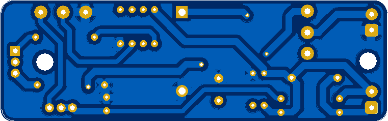

# 2 W Laser
Kontroler pro 2 W laserovou diodu M140. PCB nabízi zakladní možnosti ovladaní (on/off, nastavení proudu tekoucího do laserové diody). Trimr R4 slouži pro nastaveni maximalniho produ a R3 pro regulovani proudu tekociho do diody. Tranzistor Q1 a laserova dioda musi mit hladič!!

## Schéma zapojení:

  

## Parts:
| RefDes  | Description   | Family        | Package                   |
|---------|---------------|---------------|---------------------------|
| D1      | 1N4007        | DIODE         | DO-35                     |
| R4      | 6k8kΩ         | POTENTIOMETER | 33292W-1-502LF            |
| LED1    | LED_blue      | LED           | LED9R2_5Vb                |
| Q1      | IPP200N15N3 G | POWER_MOS_N   | TO-220-3(PG-TO-220-3)     |
| R3      | 4k7Ω          | RESISTOR      | 16PMI-4K7 SR PASSIVES     |
| R2      | 4k7Ω          | RESISTOR      | RES1300-700X250           |
| C1      | 220nF         | CAPACITOR     | CAPPR250-630X1120         |
| R1      | 1kΩ           | RESISTOR      | RES1300-700X250           |
| R6      | 1kΩ           | RESISTOR      | RES1300-700X250           |
| R5_3W   | 1Ω            | RESISTOR      | RES1500-900X250           |
| Switch1 | Switch        | SWITCH        | 1101M2S3CBE2              |
| U1      | LM358AN       | OPAMP         | MDIP-8(N08E)              |
| Power   | HDR1X2        | CONNECTOR     | 1776275-2 TE CONNECTIVITY |
| Laser   | HDR1X2        | CONNECTOR     | 1776275-2 TE CONNECTIVITY |
| C4      | 4m7F          | CAPACITOR     | CAPPR500-1000X1250        |

## PCB:
> Size: 63.5mm x 26.92mm

  
  

## Final:
work in progress ...

## Graphs:
work in progress ...

## Test:
work in progress ...
